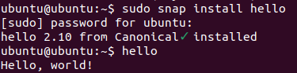
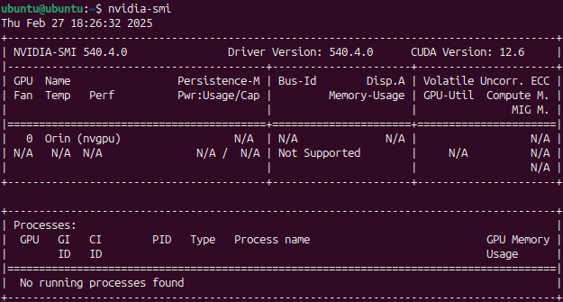

.. _install_server_jammy:

=============================================================================
Start Ubuntu server 22.04 (classic) and install Tegra firmwares and libraries
=============================================================================

Grub
====

The UEFI boot loader will automatically launch GRUB, which then will launch Ubuntu.

Ubuntu, first boot
==================

You will be required on first boot to change your password, as the pre-installed image comes with a predefined user ``ubuntu`` (password ``ubuntu``).

WLAN
====

You should be able to check the WLAN interface (using ``ip link`` for instance):

.. code-block:: bash

    $ ip link show
    1: lo: <LOOPBACK,UP,LOWER_UP> mtu 65536 qdisc noqueue state UNKNOWN mode DEFAULT group default qlen 1000
        link/loopback 00:00:00:00:00:00 brd 00:00:00:00:00:00
    2: wlP1p1s0: <BROADCAST,MULTICAST> mtu 1500 qdisc noop state DOWN mode DEFAULT group default qlen 1000
        link/ether 90:e8:68:bc:88:a9 brd ff:ff:ff:ff:ff:ff

Ubuntu server configuration
===========================

Ubuntu server comes with `netplan and systemd-networkd preinstalled`_. The initial netplan configuration in the image should already take care of the Ethernet interface. To setup a WLAN connection, you can perform the following steps to add the related configuration:

.. code-block:: bash

    # Replace <SSID> with your SSID
    SSID='<SSID>'
    # Replace <PASSWD> with your password
    PASSWD='<PASSWD>'
    # Create a netplan configuration for the WLAN
    cat <<EOF | sudo tee /etc/netplan/51-wireless.yaml
    network:
    version: 2
    wifis:
      wlP1p1s0:
        dhcp4: yes
        dhcp6: yes
        access-points:
          "$SSID":
            password: "$PASSWD"
    EOF
    sudo netplan apply

Once applied, your network interface should get up and running after a few seconds, which you can confirm using the ``ip address`` command.

.. _netplan and systemd-networkd preinstalled: https://ubuntu.com/blog/a-declarative-approach-to-linux-networking-with-netplan

Install NVIDIA proprietary software
===================================

The Ubuntu image brings anything necessary to boot Linux on a Jetson development kit. However, to unlock the features of the Orin’s SoC (wireless network, bluetooth, GPU, …) you can install additional NVIDIA proprietary drivers and libraries using a Launchpad PPA :

.. code-block:: bash

    sudo add-apt-repository ppa:ubuntu-tegra/updates
    # Install Tegra firmwares and necessary Nvidia libraries
    sudo apt install -y nvidia-tegra-drivers-36
    # Adding user to group render allows running GPU related commands as non root
    # video group is necessary to use the camera
    sudo usermod -a -G render,video ubuntu
    sudo reboot

Install CUDA and TensorRT
=========================

NVIDIA provides a few SDKs like CUDA Toolkit and TensorRT that allow building AI applications on Jetson devices. Those ones are maintained outside of Ubuntu but can be installed with the following commands:

.. code-block:: bash

    # CUDA
    sudo apt-key adv --fetch-keys "https://repo.download.nvidia.com/jetson/jetson-ota-public.asc"
    sudo add-apt-repository -y "deb https://repo.download.nvidia.com/jetson/t234 r36.4 main"
    sudo add-apt-repository -y "deb https://repo.download.nvidia.com/jetson/common r36.4 main"
    sudo apt install -y cuda

    # Tensor RT
    sudo apt install -y libnvinfer-bin libnvinfer-samples

    # cuda-samples dependencies
    sudo apt install -y cmake

    echo "export PATH=/usr/local/cuda-12.6/bin\${PATH:+:\${PATH}}" >> ~/.profile
    echo "export LD_LIBRARY_PATH=/usr/local/cuda-12.6/lib64\${LD_LIBRARY_PATH:+:\${LD_LIBRARY_PATH}}" >> ~/.profile

    # Logout or reboot to apply the profile change
    sudo reboot

Test your system
================

Snap
----

It’s Ubuntu, you can install a snap!

Nvidia system management interface
----------------------------------

``nvidia-smi`` can be used to display GPU related information.

Run GPU's sample code application
---------------------------------

CUDA samples
^^^^^^^^^^^^

You can build and run `CUDA sample`_ applications. You can start with ``deviceQuery``, but you can also build and try many others.

.. code-block:: bash

    git clone https://github.com/NVIDIA/cuda-samples.git -b v12.5
    cd cuda-samples
    cd Samples/1_Utilities/deviceQuery && make

Running this sample code should produce the following output

.. code-block::

    ubuntu@ubuntu:~/cuda-samples/Samples/1_Utilities/deviceQuery$ ./deviceQuery
    ./deviceQuery Starting...

    CUDA Device Query (Runtime API) version (CUDART static linking)

    Detected 1 CUDA Capable device(s)

    Device 0: "Orin"
    CUDA Driver Version / Runtime Version      	12.6 / 12.6
    CUDA Capability Major/Minor version number:	8.7
    Total amount of global memory:             	7618 MBytes (7987728384 bytes)
    (004) Multiprocessors, (128) CUDA Cores/MP:	512 CUDA Cores
    GPU Max Clock rate:                        	765 MHz (0.76 GHz)
    Memory Clock rate:                         	612 Mhz
    Memory Bus Width:                          	128-bit
    L2 Cache Size:                             	2097152 bytes
    Maximum Texture Dimension Size (x,y,z)     	1D=(131072), 2D=(131072, 65536), 3D=(16384, 16384, 16384)
    Maximum Layered 1D Texture Size, (num) layers  1D=(32768), 2048 layers
    Maximum Layered 2D Texture Size, (num) layers  2D=(32768, 32768), 2048 layers
    Total amount of constant memory:           	65536 bytes
    Total amount of shared memory per block:   	49152 bytes
    Total shared memory per multiprocessor:    	167936 bytes
    Total number of registers available per block: 65536
    Warp size:                                 	32
    Maximum number of threads per multiprocessor:  1536
    Maximum number of threads per block:       	1024
    Max dimension size of a thread block (x,y,z): (1024, 1024, 64)
    Max dimension size of a grid size	(x,y,z): (2147483647, 65535, 65535)
    Maximum memory pitch:                      	2147483647 bytes
    Texture alignment:                         	512 bytes
    Concurrent copy and kernel execution:      	Yes with 2 copy engine(s)
    Run time limit on kernels:                 	No
    Integrated GPU sharing Host Memory:        	Yes
    Support host page-locked memory mapping:   	Yes
    Alignment requirement for Surfaces:        	Yes
    Device has ECC support:                    	Disabled
    Device supports Unified Addressing (UVA):  	Yes
    Device supports Managed Memory:            	Yes
    Device supports Compute Preemption:        	Yes
    Supports Cooperative Kernel Launch:        	Yes
    Supports MultiDevice Co-op Kernel Launch:  	Yes
    Device PCI Domain ID / Bus ID / location ID:   0 / 0 / 0
    Compute Mode:
        < Default (multiple host threads can use ::cudaSetDevice() with device simultaneously) >

    deviceQuery, CUDA Driver = CUDART, CUDA Driver Version = 12.6, CUDA Runtime Version = 12.6, NumDevs = 1
    Result = PASS

.. _CUDA sample: https://github.com/NVIDIA/cuda-samples/tree/master

TensorRT
^^^^^^^^

.. code-block:: bash

    mkdir ${HOME}/tensorrt-samples
    ln -s /usr/src/tensorrt/data ${HOME}/tensorrt-samples/data
    cp -a /usr/src/tensorrt/samples ${HOME}/tensorrt-samples/
    cd ${HOME}/tensorrt-samples/samples/sampleAlgorithmSelector && make
    cd ${HOME}/tensorrt-samples/bin
    ./sample_algorithm_selector

Camera
^^^^^^

Prerequisites
"""""""""""""

The following commands were tested on an IMX219 camera module connected to a Nano and NX devkit.

.. code-block:: bash

    # Allow camera stack to use the right libraries
    sudo update-alternatives \
            --install /etc/ld.so.conf.d/aarch64-linux-gnu_EGL.conf \
            aarch64-linux-gnu_egl_conf \
            /usr/lib/aarch64-linux-gnu/tegra-egl/ld.so.conf 1000
    sudo update-alternatives \
            --install /etc/ld.so.conf.d/aarch64-linux-gnu_GL.conf \
            aarch64-linux-gnu_gl_conf \
            /usr/lib/aarch64-linux-gnu/nvidia/ld.so.conf 1000
    sudo ldconfig
    sudo reboot

Verify the camera is detected
"""""""""""""""""""""""""""""

Please also refer to the `NVIDIA test plan camera setup`_.

.. code-block:: bash

    # Install v4l2-ctl
    sudo apt install v4l-utils
    v4l2-ctl --list-devices
    v4l2-ctl --list-formats-ext

If your device is properly detected, the output should be close to this one:

.. code-block::

    ubuntu@ubuntu:~$ v4l2-ctl --list-devices
    NVIDIA Tegra Video Input Device (platform:tegra-camrtc-ca):
            /dev/media0

    vi-output, imx219 10-0010 (platform:tegra-capture-vi:1):
            /dev/video0

You should then be able to `detect it via the NVARGUS daemon <https://docs.nvidia.com/jetson/archives/r36.4.3/DeveloperGuide/SD/TestPlanValidation.html#verifying-imx274-camera-sensor>`_ (in this example, the ``sensor-id`` is ``0``):

.. code-block::

    ubuntu@ubuntu:~$ nvargus_nvraw --sensorinfo --c 0
    nvargus_nvraw version 1.15.0
    Number of sensors 1, Number of modes for selected sensor 5
    Selected sensor: jakku_front_RBP194 ID 0 Mode 0
    Number of exposures 1
    Index   Exposure time Range      	Sensor Gain Range
    0   	0.000013 - 0.500000      	1.000000 - 10.625000
    Warning: Maximum value of Exposure time 0.683709 secs is more than maximum Frame duration of 0.5 secs.
    Changing
        Maximum Exposure time to 0.5 secs.

.. _NVIDIA test plan camera setup: https://docs.nvidia.com/jetson/archives/r36.4.3/DeveloperGuide/SD/TestPlanValidation.html#camera

Capture a JPEG image with NVARGUS
"""""""""""""""""""""""""""""""""

Still with the same ``sensor-id``

.. code-block:: bash

    # Unset DISPLAY only if running the commands from SSH or a serial console
    unset DISPLAY

    nvargus_nvraw --c 0 --format jpg --file ${HOME}/frame-cam0.jpg

GStreamer
^^^^^^^^^

Pre-requisites
""""""""""""""

Make sure to install the necessary GStreamer packages

.. code-block:: bash

    # Install gstreamer plugins
    sudo apt install -y gstreamer1.0-tools gstreamer1.0-alsa \
        gstreamer1.0-plugins-base gstreamer1.0-plugins-good \
        gstreamer1.0-plugins-bad gstreamer1.0-plugins-ugly \
        gstreamer1.0-libav
    sudo apt install -y libgstreamer1.0-dev \
        libgstreamer-plugins-base1.0-dev \
        libgstreamer-plugins-good1.0-dev \
        libgstreamer-plugins-bad1.0-dev

Camera capture using GStreamer
""""""""""""""""""""""""""""""

.. code-block:: bash

    # Unset DISPLAY only if running the commands from SSH or a serial console
    unset DISPLAY

    # Capture an image
    gst-launch-1.0 nvarguscamerasrc num-buffers=1 sensor-id=0 ! \
        'video/x-raw(memory:NVMM), width=(int)1920, height=(int)1080,' \ 'format=(string)NV12' ! nvjpegenc ! filesink \
        location=${HOME}/gst-frame-cam0.jpg

    # Capturing Video from the Camera and Record
    gst-launch-1.0 nvarguscamerasrc num-buffers=300 sensor-id=0 ! \
        'video/x-raw(memory:NVMM), width=(int)1920, height=(int)1080,' \
        'format=(string)NV12, framerate=(fraction)30/1' ! \
        nvv4l2h265enc bitrate=8000000 ! h265parse ! qtmux ! \
        filesink location=test.mp4

Transcode using GStreamer
"""""""""""""""""""""""""

Using a stream from the [Big Buck Bunny project](https://peach.blender.org/), you can easily test the transcoding pipelines (note that Jetson Orin Nano don’t have hardware encoders and won’t be able to run these pipelines):

.. code-block:: bash

    sudo apt install unzip
    wget -nv https://download.blender.org/demo/movies/BBB/bbb_sunflower_1080p_30fps_normal.mp4.zip
    unzip -qu bbb_sunflower_1080p_30fps_normal.mp4.zip
    echo "H.264 Decode (NVIDIA Accelerated Decode) to H265 encode"
    gst-launch-1.0 filesrc location=bbb_sunflower_1080p_30fps_normal.mp4 ! qtdemux ! queue ! \
        h264parse ! nvv4l2decoder ! nvv4l2h265enc bitrate=8000000 ! h265parse ! \
        qtmux ! filesink location=h265-reenc.mp4 -e
    echo "H.265 Decode (NVIDIA Accelerated Decode) to AV1 Encode (NVIDIA Accelerated Encode)"
    gst-launch-1.0 filesrc location=h265-reenc.mp4 ! qtdemux ! queue ! h265parse ! nvv4l2decoder ! \
        nvv4l2av1enc ! matroskamux name=mux ! filesink location=av1-reenc.mkv -e
    echo "AV1 Decode (NVIDIA Accelerated Decode) to H.264 encode"
    gst-launch-1.0 filesrc location=av1-reenc.mkv ! matroskademux ! queue ! nvv4l2decoder ! \
        nvv4l2h264enc bitrate=20000000 ! h264parse ! queue ! qtmux name=mux ! filesink \
        location=h264-reenc.mp4 -e
    echo "H.264 Decode (NVIDIA Accelerated Decode) to AV1"
    gst-launch-1.0 filesrc location=h264-reenc.mp4 ! qtdemux ! \
        h264parse ! nvv4l2decoder ! nvv4l2av1enc ! matroskamux name=mux ! \
        filesink location=av1-reenc.mkv -e

cuDNN
^^^^^

Prerequisite
""""""""""""

.. code-block:: bash

    sudo apt install cudnn libcudnn9-samples

Run cuDNN Samples
"""""""""""""""""

Build and run the Converted sample.

.. code-block:: bash

    cd /usr/src/cudnn_samples_v9
    cd conv_sample
    sudo make -j8

    sudo chmod +x run_conv_sample.sh
    sudo ./run_conv_sample.sh

You can also try other sample applications.

Nvidia Container runtime
""""""""""""""""""""""""

You can follow the `NVIDIA container test plan`_ to install and configure the `NVIDIA Container Toolkit`_ before running the JetPack container.
Try to run a previously built CUDA sample application:

.. code-block:: bash

    sudo docker run --rm -it -e DISPLAY --net=host --runtime \
        nvidia -v /tmp/.X11-unix/:/tmp/.X11-unix  -v \
        ${HOME}/cuda-samples:/root/cuda-samples \
        nvcr.io/nvidia/l4t-jetpack:r36.3.0 \
        /root/cuda-samples/Samples/1_Utilities/deviceQuery/deviceQuery

.. _NVIDIA container test plan: https://docs.nvidia.com/jetson/archives/r36.4.3/DeveloperGuide/SD/TestPlanValidation.html#nvidia-containers
.. _NVIDIA container toolkit: https://docs.nvidia.com/datacenter/cloud-native/container-toolkit/latest/install-guide.html#installing-the-nvidia-container-toolkit

Install the desktop environment
"""""""""""""""""""""""""""""""

Some use cases might require a desktop environment. To turn your Ubuntu server image into a Desktop one, with hardware accelerated rendering, run the following commands:

.. code-block:: bash

    sudo apt install -y ubuntu-desktop-minimal
    sudo sed -i 's/allowed_users.*/allowed_users=anybody/' "/etc/X11/Xwrapper.config"
    echo "needs_root_rights=yes" | sudo tee -a "/etc/X11/Xwrapper.config"
    sudo sed 's/#WaylandEnable=false/WaylandEnable= false/' -i /etc/gdm3/custom.conf
    sudo adduser gdm video
    sudo reboot

VPI
^^^

Prerequisites for VPI
"""""""""""""""""""""

Install VPI and its sample applications

.. code-block:: bash

    sudo apt install nvidia-vpi vpi3-samples libopencv cmake libpython3-dev python3-numpy libopencv-python

Test
""""

Execute steps 1 to 6 from the `NVIDIA VPI test plan`_, for each VPI sample application.

.. _NVIDIA VPI test plan: https://docs.nvidia.com/jetson/archives/r36.4.3/DeveloperGuide/SD/TestPlanValidation.html#vpi
