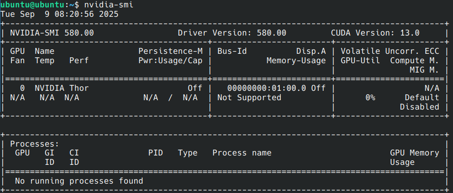

.. _install_server_noble:

=====================================
NVIDIA JetPack on Ubuntu Server 24.04
=====================================

Install NVIDIA proprietary software
===================================

The Ubuntu image brings everything necessary to boot Linux on a Jetson developer kit. However, to unlock the features of the Tegra SoC (wireless network, Bluetooth, GPU, …) you can install additional NVIDIA proprietary drivers and libraries using the NVIDIA package repository:

.. code-block:: bash

    sudo apt-key adv --fetch-keys "https://repo.download.nvidia.com/jetson/jetson-ota-public.asc"
    sudo add-apt-repository -y "deb https://repo.download.nvidia.com/jetson/common r38.4 main"
    sudo add-apt-repository -y "deb https://repo.download.nvidia.com/jetson/som r38.4 main"
    # Install Tegra firmwares and necessary NVIDIA libraries
    sudo apt install -y nvidia-l4t-firmware nvidia-l4t-firmware-openrm nvidia-l4t-core nvidia-l4t-nvml nvidia-l4t-init
    # Adding user to group render allows running GPU related commands as non root
    # video group is necessary to use the camera
    sudo usermod -a -G render,video ubuntu
    sudo reboot

Upgrade the system (optional)
=============================

Upgrade the system to install the kernel updates

.. code-block:: bash

    sudo apt update; sudo apt upgrade

Install CUDA and TensorRT
=========================

SDKs like CUDA Toolkit and TensorRT that allow building AI applications on Jetson devices are available directly from NVIDIA:

.. code-block:: bash

    # CUDA
    sudo wget https://developer.download.nvidia.com/compute/cuda/repos/ubuntu2404/sbsa/cuda-keyring_1.1-1_all.deb
    sudo dpkg -i cuda-keyring_1.1-1_all.deb
    sudo apt update
    sudo apt install -y nvidia-l4t-cuda cuda-toolkit-13-0

    # Tensor RT
    sudo apt install -y libnvinfer-bin libnvinfer-samples

    # cuda-samples dependencies
    sudo apt install -y cmake

    echo "export PATH=/usr/local/cuda/bin\${PATH:+:\${PATH}}" >> ~/.profile
    echo "export LD_LIBRARY_PATH=/usr/local/cuda/lib64\${LD_LIBRARY_PATH:+:\${LD_LIBRARY_PATH}}" >> ~/.profile

    # Logout or reboot to apply the profile change
    sudo reboot

Test your system
================

NVIDIA system management interface
----------------------------------

``nvidia-smi`` can be used to display GPU related information.

Run GPU's sample code application
---------------------------------

CUDA samples
^^^^^^^^^^^^

You can build and run `CUDA sample`_ applications. You can start with ``deviceQuery``, but you can also build and try many others.

.. code-block:: bash

    git clone https://github.com/NVIDIA/cuda-samples.git -b v13.0
    cd cuda-samples
    cd Samples/1_Utilities/deviceQuery && cmake . && make

Running this sample code should produce the following output

.. code-block::

    ubuntu@ubuntu:~/cuda-samples/Samples/1_Utilities/deviceQuery$ ./deviceQuery
    ./deviceQuery Starting...

    CUDA Device Query (Runtime API) version (CUDART static linking)
    
    Detected 1 CUDA Capable device(s)
    
    Device 0: "NVIDIA Thor"
      CUDA Driver Version / Runtime Version          13.0 / 13.0
      CUDA Capability Major/Minor version number:    11.0
      Total amount of global memory:                 125517 MBytes (131614285824 bytes)
      (020) Multiprocessors, (128) CUDA Cores/MP:    2560 CUDA Cores
      GPU Max Clock rate:                            1049 MHz (1.05 GHz)
      Memory Clock rate:                             0 Mhz
      Memory Bus Width:                              0-bit
      L2 Cache Size:                                 33554432 bytes
      Maximum Texture Dimension Size (x,y,z)         1D=(131072), 2D=(131072, 65536), 3D=(16384, 16384, 16384)
      Maximum Layered 1D Texture Size, (num) layers  1D=(32768), 2048 layers
      Maximum Layered 2D Texture Size, (num) layers  2D=(32768, 32768), 2048 layers
      Total amount of constant memory:               65536 bytes
      Total amount of shared memory per block:       49152 bytes
      Total shared memory per multiprocessor:        233472 bytes
      Total number of registers available per block: 65536
      Warp size:                                     32
      Maximum number of threads per multiprocessor:  1536
      Maximum number of threads per block:           1024
      Max dimension size of a thread block (x,y,z): (1024, 1024, 64)
      Max dimension size of a grid size    (x,y,z): (2147483647, 65535, 65535)
      Maximum memory pitch:                          2147483647 bytes
      Texture alignment:                             512 bytes
      Concurrent copy and kernel execution:          Yes with 1 copy engine(s)
      Run time limit on kernels:                     No
      Integrated GPU sharing Host Memory:            Yes
      Support host page-locked memory mapping:       Yes
      Alignment requirement for Surfaces:            Yes
      Device has ECC support:                        Disabled
      Device supports Unified Addressing (UVA):      Yes
      Device supports Managed Memory:                Yes
      Device supports Compute Preemption:            Yes
      Supports Cooperative Kernel Launch:            Yes
      Device PCI Domain ID / Bus ID / location ID:   0 / 1 / 0
      Compute Mode:
         < Default (multiple host threads can use ::cudaSetDevice() with device simultaneously) >
    
    deviceQuery, CUDA Driver = CUDART, CUDA Driver Version = 13.0, CUDA Runtime Version = 13.0, NumDevs = 1
    Result = PASS

.. _CUDA sample: https://github.com/NVIDIA/cuda-samples/tree/master

TensorRT
^^^^^^^^

.. code-block:: bash

    mkdir ${HOME}/tensorrt-samples
    ln -s /usr/src/tensorrt/data ${HOME}/tensorrt-samples/data
    cp -a /usr/src/tensorrt/samples ${HOME}/tensorrt-samples/
    cd ${HOME}/tensorrt-samples/samples/sampleProgressMonitor && make -j 8
    cd ${HOME}/tensorrt-samples/bin
    ./sample_progress_monitor

GStreamer
^^^^^^^^^

Prerequisites for GStreamer
"""""""""""""""""""""""""""

Make sure to install the necessary GStreamer packages

.. code-block:: bash

    # Install GStreamer plugins and NVIDIA codecs
    sudo apt install -y gstreamer1.0-tools gstreamer1.0-alsa \
        gstreamer1.0-plugins-base gstreamer1.0-plugins-good \
        gstreamer1.0-plugins-bad gstreamer1.0-plugins-ugly \
        gstreamer1.0-libav nvidia-l4t-gstreamer \
        nvidia-l4t-3d-core nvidia-l4t-gbm nvidia-l4t-multimedia-openrm nvidia-l4t-video-codec-openrm
    sudo apt install -y libgstreamer1.0-dev \
        libgstreamer-plugins-base1.0-dev \
        libgstreamer-plugins-good1.0-dev \
        libgstreamer-plugins-bad1.0-dev

`Transcode using GStreamer <https://docs.nvidia.com/jetson/archives/r38.4/DeveloperGuide/SD/TestPlanValidation.html#transcode-using-gstreamer>`_
""""""""""""""""""""""""""""""""""""""""""""""""""""""""""""""""""""""""""""""""""""""""""""""""""""""""""""""""""""""""""""""""""""""""""""""""

Using a stream from the `Big Buck Bunny project <https://peach.blender.org/>`_, you can easily test the transcoding pipelines:

.. code-block:: bash

    sudo apt install unzip
    wget -nv https://download.blender.org/demo/movies/BBB/bbb_sunflower_1080p_30fps_normal.mp4.zip
    unzip -qu bbb_sunflower_1080p_30fps_normal.mp4.zip
    echo "H.264 Decode (NVIDIA Accelerated Decode) to H265 encode"
    gst-launch-1.0 filesrc location=bbb_sunflower_1080p_30fps_normal.mp4 ! qtdemux ! queue ! \
        h264parse ! nvv4l2decoder ! nvv4l2h265enc bitrate=8000000 ! h265parse ! \
        qtmux ! filesink location=h265-reenc.mp4 -e
    echo "H.265 Decode (NVIDIA Accelerated Decode) to H.264 encode"
    gst-launch-1.0 filesrc location=h265-reenc.mp4 ! qtdemux ! queue ! h265parse ! nvv4l2decoder ! \
        nvv4l2h264enc bitrate=20000000 ! h264parse ! queue ! qtmux name=mux ! \
        filesink location=h264-reenc.mp4 -e

cuDNN
^^^^^

Prerequisite
""""""""""""

.. code-block:: bash

    sudo apt install cudnn libcudnn9-samples

`Run cuDNN Samples <https://docs.nvidia.com/jetson/archives/r38.4/DeveloperGuide/SD/TestPlanValidation.html#run-cudnn-samples>`_
""""""""""""""""""""""""""""""""""""""""""""""""""""""""""""""""""""""""""""""""""""""""""""""""""""""""""""""""""""""""""""""""

Build and run the Converted sample.

.. code-block:: bash

    cd /usr/src/cudnn_samples_v9
    cd conv_sample
    sudo make -j8

    sudo chmod +x run_conv_sample.sh
    sudo ./run_conv_sample.sh

You can also try other sample applications.

VPI
^^^

Prerequisites for VPI
"""""""""""""""""""""

Install VPI and its sample applications

.. code-block:: bash

    sudo apt install nvidia-l4t-pva nvidia-vpi vpi4-samples libopencv cmake libpython3-dev python3-numpy libopencv-python python3-pil

Test
""""

Execute steps 1 to 6 from the `NVIDIA VPI test plan`_, for each VPI sample application.

.. _NVIDIA VPI test plan: https://docs.nvidia.com/jetson/archives/r38.4/DeveloperGuide/SD/TestPlanValidation.html#vpi
