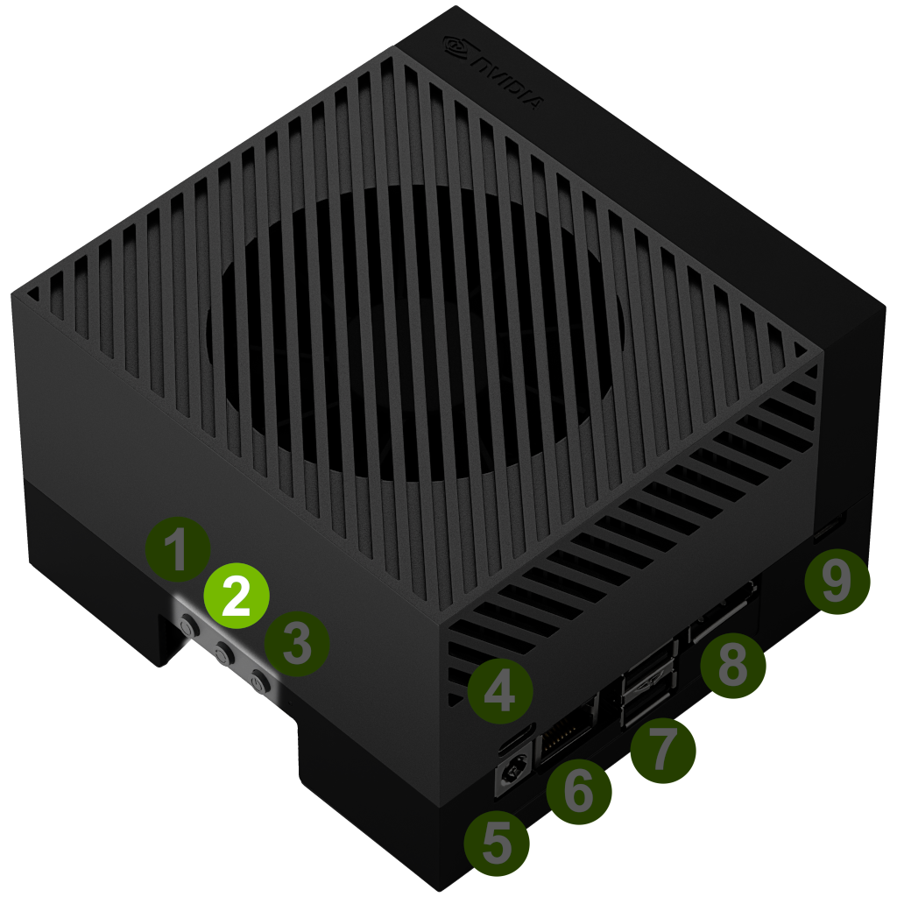
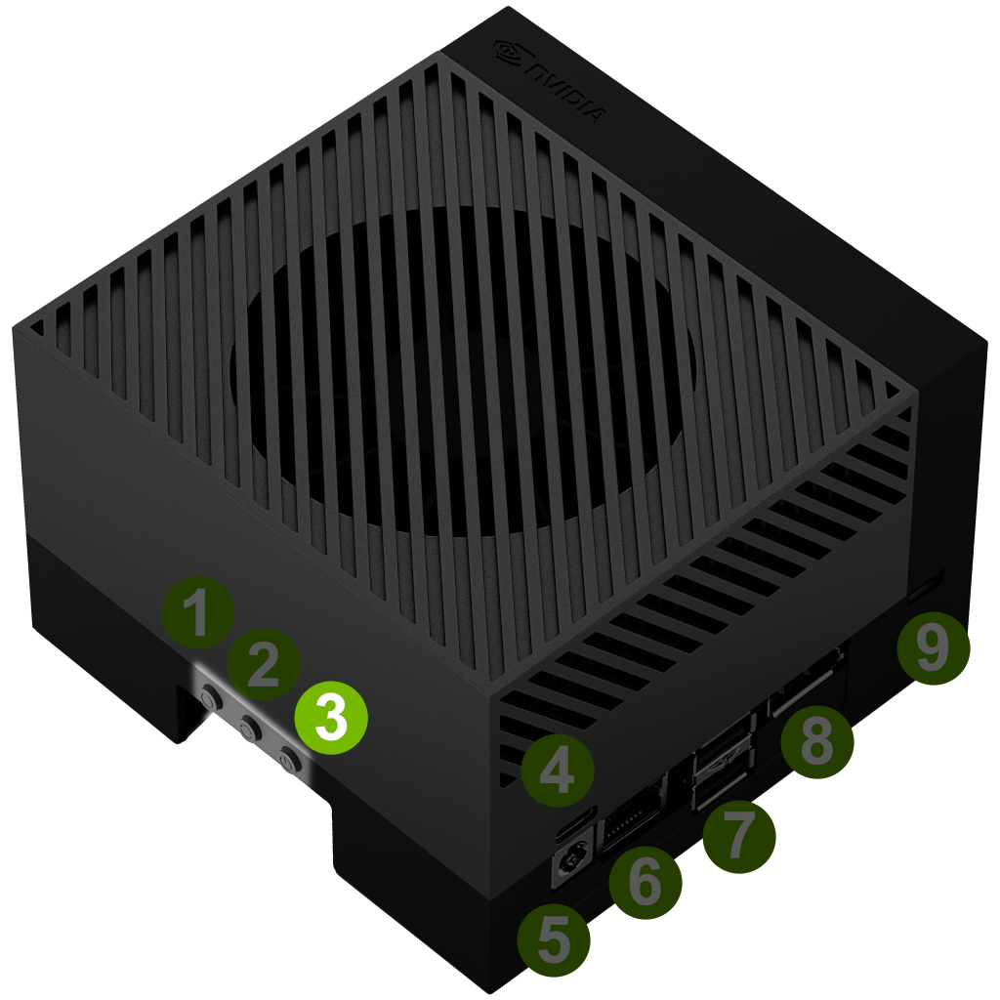

.. _flash:

Program an Ubuntu image
=======================

Prerequisites
-------------

* Ubuntu image and boot firmware downloaded
* A laptop or PC (host: x86 architecture) running Ubuntu (following instructions have been tested with 22.04, but should be compatible with later versions as well)
* A monitor with DP port and an USB keyboard
* An USB-C (device side) cable connecting the host to the device
* A 2 pin jumper cap connector (only necessary for Nano/NX)
* A boot media to program your image on:

  * SD card: cheap but don’t expect great performance
  * USB: for the same reasons than above, prefer a real disk than a stick
  * NVMe disk: must be installed to the dedicated PCIe slot

All the following commands are intended to be run as a normal user (no root).

Preparation
-----------

The Linux for Tegra tools installed with the boot firmware tarball contain scripts used to flash the software of a Jetson board, both firmware and operating system. Ubuntu image has been tested using the boot firmware linked on the `Ubuntu download page for NVIDIA Jetson`_ (note: all versions are published by Nvidia on the `Linux Tegra download page`_ and can be retrieved by clicking “Driver Package (BSP)”). In order to use the tools, first install the following packages

.. code-block:: bash

    sudo apt install -y python3 mkbootimg bzip2 cpp device-tree-compiler

Extract the boot firmware tarball

.. code-block:: bash

    tar xf Jetson_Linux_R36.4.3_aarch64.tbz2 && cd Linux_for_Tegra/

Install missing dependencies and fix file permissions

.. code-block:: bash

    sudo ./tools/l4t_flash_prerequisites.sh

.. _Ubuntu download page for Nvidia Jetson: https://ubuntu.com/download/nvidia-jetson
.. _Linux Tegra download page: https://developer.nvidia.com/linux-tegra

.. _devkit-recovery-mode:

Put the devkit into recovery mode
---------------------------------

While the operation is quite similar, the procedure to enable the recovery mode differs with every kit. First connect the USB cable between the host (should be type A) and the kit (type C, on AGX devkit it is the one located close to the 40-pin connector). Once the recovery mode is enabled, the host should detect an USB device ``0955:7X23 NVIDIA Corp. APX``, with X being one of {0,2,3,4,5,6} (see the `NVIDIA Jetson Quick Start reference`_).

Note that once an image is up and running on the device, alternative ways could also be used:

* From the Ubuntu Linux shell, run this command

.. code-block:: bash

    sudo reboot --force forced-recovery

* From the :ref:`UEFI menu<UEFI-menu>`, enter “Device Manager” menu, then “Boot Configuration” and check the “Boot Into Recovery” option before saving, and exit the UEFI menu with “Continue”

.. _NVIDIA Jetson Quick Start reference: https://docs.nvidia.com/jetson/archives/r36.4.3/DeveloperGuide/IN/QuickStart.html?#to-determine-whether-the-developer-kit-is-in-force-recovery-mode

Recovery on Jetson AGX Orin
^^^^^^^^^^^^^^^^^^^^^^^^^^^

The simplest way is to use the buttons on the front panel of the kit (see `NVIDIA Jetson AGX Orin user guide`_)

1. Press and hold down the Force Recovery button (button 2\)

2. Press and hold down the Reset button (button 3\)

3. Release both buttons.

.. _NVIDIA Jetson AGX Orin user guide: https://developer.nvidia.com/embedded/learn/jetson-agx-orin-devkit-user-guide/howto.html

Recovery on Jetson Orin Nano/NX
^^^^^^^^^^^^^^^^^^^^^^^^^^^^^^^

1. With the kit powered off, connect pins 9 (``GND``) and 10 (``FC REC``) of the 12 pins Button Header (using a 2 pins jumper cap connector, for details, check the `carrier board specification`_)
2. Power-on the kit
3. Program the boot firmware or Ubuntu image
4. (Optionally) Power-off the kit and remove the jumper cap connector, otherwise the next hard reboot of the kit will enable the recovery mode once again

.. _carrier board specification: https://developer.nvidia.com/embedded/downloads#?search=Jetson%20Orin%20Nano%20Developer%20Kit%20Carrier%20Board%20Specification

Program the boot firmware (QSPI upgrade)
--------------------------------------------

From the Linux\_for\_Tegra directory, enter the following command to program the latest :abbr:`QSPI (Queued Serial Peripheral Interface)` boot firmware, it will then reboot the kit automatically upon success.

QSPI for Jetson AGX Orin
^^^^^^^^^^^^^^^^^^^^^^^^

.. code-block:: bash

    sudo ./flash.sh p3737-0000-p3701-0000-qspi internal

QSPI for Jetson Orin Nano/NX
^^^^^^^^^^^^^^^^^^^^^^^^^^^^

.. code-block:: bash

    sudo ./flash.sh p3768-0000-p3767-0000-a0-qspi internal

(Optional) Program a device tree overlay with the boot firmware (camera support)
--------------------------------------------------------------------------------

While Jetpack relies on ``ExtLinux`` to boot, Ubuntu is launched by GRUB, which currently doesn't support device tree overlay. As a consequence, in order to use a camera connected to a Jetson development kit, the related overlay must be programmed along with the boot firmware.
First, locate the appropriate ``.dtbo`` file for your camera in the ``Linux_for_Tegra/kernel/dtb`` directory, then append a ``ADDITIONAL_DTB_OVERLAY=<DTBO file name>`` argument to the command line. For instance:

.. code-block:: bash

    # AGX devkit with LI Dual IMX274 camera module
    sudo ADDITIONAL_DTB_OVERLAY=tegra234-p3737-camera-dual-imx274-overlay.dtbo ./flash.sh p3737-0000-p3701-0000-qspi internal

    # Nano or NX devkit with an IMX219 camera on CSI slot 0
    sudo ADDITIONAL_DTB_OVERLAY=tegra234-p3767-camera-p3768-imx219-A.dtbo ./flash.sh p3768-0000-p3767-0000-a0-qspi internal

    # Nano or NX devkit with an IMX219 camera on CSI slot 0 and IMX477 camera on slot 1
    sudo ADDITIONAL_DTB_OVERLAY=tegra234-p3767-camera-p3768-imx219-imx477.dtbo ./flash.sh p3768-0000-p3767-0000-a0-qspi internal

Program the Ubuntu image on your external boot media
----------------------------------------------------

1. Insert your boot media on the host and check its device name (using ``lsblk`` or ``dmesg``)
2. Copy the image over the boot media (assuming here it is detected as ``/dev/sda``)

.. code-block:: bash

    xzcat ubuntu-22.04-preinstalled-server-arm64+tegra-igx.img.xz | sudo dd of=/dev/sda bs=16M status=progress
    sudo sync

3. Remove the boot media from the host, insert it on the kit

(Alternatively) Program the Ubuntu image using the Nvidia L4T restore script
^^^^^^^^^^^^^^^^^^^^^^^^^^^^^^^^^^^^^^^^^^^^^^^^^^^^^^^^^^^^^^^^^^^^^^^^^^^^

This method is the easiest way to program an internal disk, such as eMMC or pre-installed NVMe disk. It also allows you to program the image with limited human interaction (such as programming an external boot media with a side computer, then plugging it to the development kit).

As a prerequisite for this method, you need to put the board into :ref:`recovery mode<devkit-recovery-mode>`. You can then use the `backup-restore tool from Nvidia`_ to install a raw disk image on any installed media. The tool loads an initrd flash image via the USB-C cable and boots it, enabling an IPv6 network connection over USB. It relies on the ``nfs-kernel-server`` service to host the raw image, allowing a NFS mount on the development kit, connected to the host machine (which runs the script). The script will use SSH to connect to the initrd image, mount the NFS volume, and perform the raw image copy using dd. Therefore, the boot media must be connected to the development kit, and a root file system must be available on the host for the development kit to boot from. For this purpose, you should download and extract the Sample Root Filesystem provided by NVIDIA with the version of Linux for Tegra you are using (downloaded from the `Jetson Linux archive`_), running similar commands in the Linux\_for\_Tegra directory:

.. code-block:: bash

    sudo tar xf Tegra_Linux_Sample_Root-Filesystem_R36.4.3_aarch64.tbz2 -C rootfs
    sudo ./apply_binaries.sh

You can now use the backup\_restore tools to flash your device. From the Linux\_for\_Tegra directory, enter the following command :

.. code-block:: bash

    sudo ./tools/backup_restore/l4t_backup_restore.sh -r --raw-image \
    jammy-preinstalled-server-arm64+tegra-igx.img -e <device> <board-type>

    # Full example
    sudo ./tools/backup_restore/l4t_backup_restore.sh -r --raw-image \
    jammy-preinstalled-server-arm64+tegra-igx.img -e nvme0n1 \
    jetson-orin-nano-devkit

Board type:

* Jetson AGX Orin: ``jetson-agx-orin-devkit``
* Jetson Orin Nano/NX: ``jetson-orin-nano-devkit``

Device:

* SD card: ``mmcblk0`` (for devices without eMMC, like Nano or NX) or ``mmcblk1`` (for Jetson AGX)
* USB media: ``sda``
* NVMe disk: ``nvme0n1``

.. _backup-restore tool from Nvidia: https://docs.nvidia.com/jetson/archives/r36.4.3/DeveloperGuide/SD/FlashingSupport.html?highlight=backup#backing-up-and-restoring-a-jetson-device
.. _jetson linux archive: https://developer.nvidia.com/embedded/jetson-linux-archive

Connect a monitor
-----------------

You can connect to your development kit a USB keyboard/mouse and a monitor using a Display-Port cable. You can follow the boot and kernel execution on display, then get a console prompt once Ubuntu is started.

.. _UEFI-menu:

UEFI menu
---------

At every boot, you will get a chance to enter the UEFI menu by pressing Escape or F11 key.

.. code-block::

    Jetson System firmware version 36.4.3-gcid-38968081 date 2025-01-08T01:18:20+00:00
    ESC   to enter Setup.
    F11   to enter Boot Manager Menu.
    Enter to continue boot.
    **  WARNING: Test Key is used.  **
    ..

This menu will eventually allow you to select a different boot option. If you don’t press a key, UEFI will automatically launch the default option.
